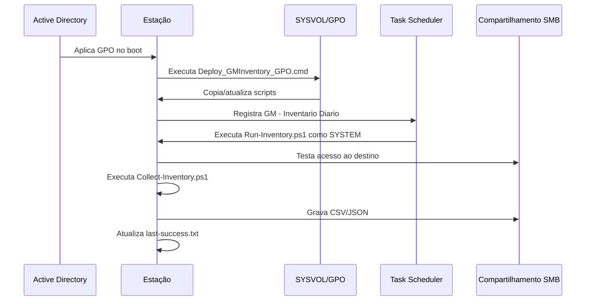

# Arquitetura

## Fluxo



## Componentes

### Deploy_GMInventory_GPO.cmd

Bootstrap executado como Startup Script. Sincroniza os scripts para `C:\ProgramData\GMInventory` e registra/atualiza a tarefa.

### Install-InventoryTask.ps1

Cria a tarefa agendada como `SYSTEM`. O atraso de Startup é calculado a partir do hostname e varia de 2 a 10 minutos. O fallback de Logon varia de 1 a 5 minutos.

### Run-Inventory.ps1

Controla o destino central, uma coleta por dia, retry de rede, logging, código de saída e execução do coletor.

### Collect-Inventory.ps1

Realiza a coleta e grava os artefatos por computador.

Na v8.2-GM, o resumo de rede considera apenas interfaces físicas ativas e remove APIPA. VPNs, interfaces virtuais e demais endereços continuam disponíveis nos relatórios detalhados.

## Persistência local

```text
C:\ProgramData\GMInventory
├── Collect-Inventory.ps1
├── Run-Inventory.ps1
├── Install-InventoryTask.ps1
├── logs
│   ├── gpo-deploy.log
│   └── inventario-<PC>-<YYYYMMDD>.log
└── state
    └── last-success.txt
```

## Persistência central

```text
InventoryRoot
└── PC01
    ├── resumo-PC01.csv
    ├── seguranca-PC01.csv
    ├── interfaces-PC01.csv
    ├── rede-PC01.csv
    ├── discos-PC01.csv
    ├── volumes-PC01.csv
    ├── ...
    ├── inventario-atual-PC01.json
    └── Historico
        └── inventario-PC01-YYYYMMDD.json
```

## Segurança

A execução como `SYSTEM` evita armazenar credenciais no script. Em SMB remoto, o acesso depende da conta de computador e das permissões do compartilhamento e do NTFS.
