# Arquitetura

```mermaid
flowchart LR
    AD[Active Directory] --> GPO[GPO de Computadores]
    GPO --> SYSVOL[Startup Script / SYSVOL]
    SYSVOL --> DEPLOY[Deploy-Inventory-GPO.cmd]
    DEPLOY --> LOCAL[C:\ProgramData\InventoryAgent]
    LOCAL --> TASK[Inventory - Daily / SYSTEM]
    TASK --> RUNNER[Run-Inventory.ps1]
    RUNNER --> COLLECT[Collect-Inventory.ps1]
    COLLECT --> SMB[Compartilhamento SMB]
```

## Componentes

- **Active Directory**: organiza computadores e grupos de segurança.
- **GPO**: distribui o script de inicialização para o escopo autorizado.
- **SYSVOL**: armazena o deploy e os componentes do agente.
- **Deploy**: copia ou atualiza os componentes locais.
- **Scheduled Task**: executa o runner como `NT AUTHORITY\SYSTEM`.
- **Runner**: controla uma coleta bem-sucedida por dia, retry e logs.
- **Collector**: coleta hardware, Windows, rede, segurança, software e atualizações.
- **SMB**: recebe uma pasta individual por computador.

## Segurança

O agente não armazena senha. Em um compartilhamento SMB remoto, o contexto `SYSTEM` usa a conta de computador do domínio. O acesso deve ser restrito por grupo de segurança e ACLs adequadas.

O repositório público não deve conter IPs, domínios, nomes de servidores, usuários, empresas, OUs ou compartilhamentos reais.
