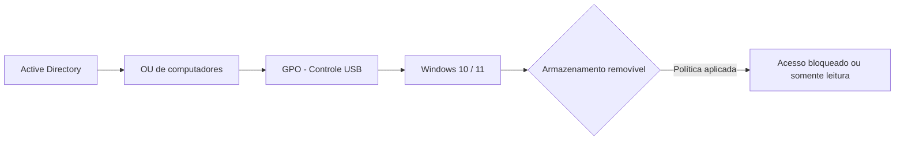

# GPO — Controle de armazenamento USB no Windows

Guia prático para controlar **pendrives, HDs externos e outras classes de armazenamento removível** em computadores Windows ingressados em domínio Active Directory.

> Este guia trata de **armazenamento removível**. Ele não foi feito para bloquear teclado, mouse ou outros periféricos USB comuns.

## Objetivo

Aplicar uma política centralizada para reduzir riscos como:

- cópia não autorizada de arquivos;
- entrada de malware por mídia removível;
- vazamento de dados;
- uso de dispositivos de armazenamento não aprovados.

## Arquitetura



## Requisitos

- Active Directory Domain Services;
- Group Policy Management Console (`gpmc.msc`);
- computadores Windows ingressados no domínio;
- uma OU de homologação ou um pequeno grupo de máquinas para teste.

## Modos recomendados

Antes de criar a GPO, defina o nível de bloqueio.

### Opção A — bloquear gravação

O usuário consegue **ler** arquivos do dispositivo, mas não consegue copiar dados corporativos para ele.

Política:

```text
Removable Disks: Deny write access
```

### Opção B — bloquear leitura

O Windows impede a leitura de discos removíveis.

Política:

```text
Removable Disks: Deny read access
```

### Opção C — bloquear todo o armazenamento removível

Mais restritiva.

Política:

```text
All Removable Storage classes: Deny all access
```

> A opção C tem precedência sobre políticas individuais de classes de armazenamento removível.

---

# Passo a passo

## 1. Abra o Gerenciamento de Política de Grupo

No controlador de domínio ou em uma estação administrativa com RSAT:

```text
gpmc.msc
```

## 2. Crie uma GPO

No **Group Policy Management**:

1. localize a OU onde estão os computadores de teste;
2. clique com o botão direito na OU;
3. selecione **Create a GPO in this domain, and Link it here...**;
4. use um nome claro, por exemplo:

```text
GPO - Controle de Armazenamento USB
```

> Comece em uma OU de homologação. Não aplique diretamente em toda a empresa no primeiro teste.

## 3. Edite a GPO

Clique com o botão direito na GPO criada e selecione **Edit**.

Acesse:

```text
Computer Configuration
└── Policies
    └── Administrative Templates
        └── System
            └── Removable Storage Access
```

Em Windows em português, o caminho corresponde a:

```text
Configuração do Computador
└── Políticas
    └── Modelos Administrativos
        └── Sistema
            └── Acesso ao Armazenamento Removível
```

## 4. Escolha o bloqueio

### Cenário recomendado para prevenção de vazamento

Habilite:

```text
Removable Disks: Deny write access
```

Isso impede gravação em discos removíveis e costuma causar menos impacto operacional.

### Cenário de bloqueio total

Habilite:

```text
All Removable Storage classes: Deny all access
```

Depois clique em:

```text
Enabled
Apply
OK
```

## 5. Teste primeiro em uma máquina piloto

Use somente uma máquina de teste ou uma OU de homologação.

Na estação:

```cmd
gpupdate /force
```

Se necessário, reinicie:

```cmd
shutdown /r /t 0
```

## 6. Confirme se a GPO foi aplicada

Execute:

```cmd
gpresult /r /scope computer
```

Para gerar um relatório mais completo:

```cmd
gpresult /h C:\Temp\gpo-report.html
```

Abra o arquivo `C:\Temp\gpo-report.html` e confirme se a GPO aparece entre as políticas aplicadas.

Também é possível verificar com:

```text
rsop.msc
```

## 7. Teste o dispositivo USB

Insira um pendrive de teste.

Resultado esperado depende da política configurada:

| Política | Leitura | Gravação |
|---|---:|---:|
| Deny write access | Permitida | Bloqueada |
| Deny read access | Bloqueada | Afetada pelo bloqueio de leitura |
| Deny all access | Bloqueada | Bloqueada |

## 8. Expanda gradualmente

Depois que o piloto funcionar:

1. aplique em um pequeno grupo de computadores;
2. valide sistemas que dependem de mídias removíveis;
3. documente exceções;
4. só então amplie para as demais OUs.

---

# Aplicação seletiva

Existem duas estratégias simples.

## Estratégia 1 — OU dedicada

Crie uma OU com apenas os computadores que devem receber a política.

Exemplo:

```text
Workstations
├── USB-Controlled
└── USB-Exception
```

É a opção mais simples para ambientes pequenos e médios.

## Estratégia 2 — Security Filtering

Para ambientes maiores, utilize um grupo de segurança de computadores, por exemplo:

```text
GPO-USB-BLOCK-COMPUTERS
```

Adicione somente as contas de computador autorizadas ao escopo da política.

Ao alterar **Security Filtering**, mantenha permissões de leitura adequadas para que o processamento da GPO não seja quebrado.

---

# Como desfazer

Para remover o bloqueio:

1. edite a GPO;
2. altere a política para **Not Configured**;
3. execute na estação:

```cmd
gpupdate /force
```

Se necessário, reinicie o computador.

Nunca apague uma GPO em produção antes de confirmar seu escopo, vínculos e dependências.

---

# Troubleshooting

## A GPO não aparece no gpresult

Verifique:

- se o computador está na OU correta;
- se o vínculo da GPO está habilitado;
- se existe Security Filtering impedindo a aplicação;
- se há bloqueio de herança;
- se outra GPO possui precedência.

Use:

```cmd
gpresult /h C:\Temp\gpo-report.html
```

## O pendrive continua funcionando

Confirme que a configuração foi feita em:

```text
Computer Configuration
```

Verifique também se a política aparece como aplicada e teste novamente após `gpupdate /force` ou reinicialização.

## Mouse e teclado devem continuar funcionando?

Sim. Este guia utiliza políticas de **Removable Storage Access**, voltadas para classes de armazenamento removível, e não uma desativação geral das portas USB.

---

# Boas práticas

- use uma OU de homologação;
- comece bloqueando somente gravação se o objetivo principal for evitar vazamento;
- valide scanners, tokens, coletores de dados e dispositivos especializados antes da expansão;
- registre as exceções aprovadas;
- não use `Enforced` sem necessidade;
- mantenha uma política de rollback documentada;
- combine GPO com BitLocker, EDR/antivírus e políticas de DLP quando necessário.

## Referência Microsoft

Microsoft Learn — ADMX Removable Storage:

https://learn.microsoft.com/windows/client-management/mdm/policy-csp-admx-removablestorage

---

## Aviso

Teste qualquer alteração de GPO em ambiente controlado antes de aplicar em produção. O comportamento final pode variar conforme versão do Windows, políticas já existentes e dispositivos utilizados no ambiente.
